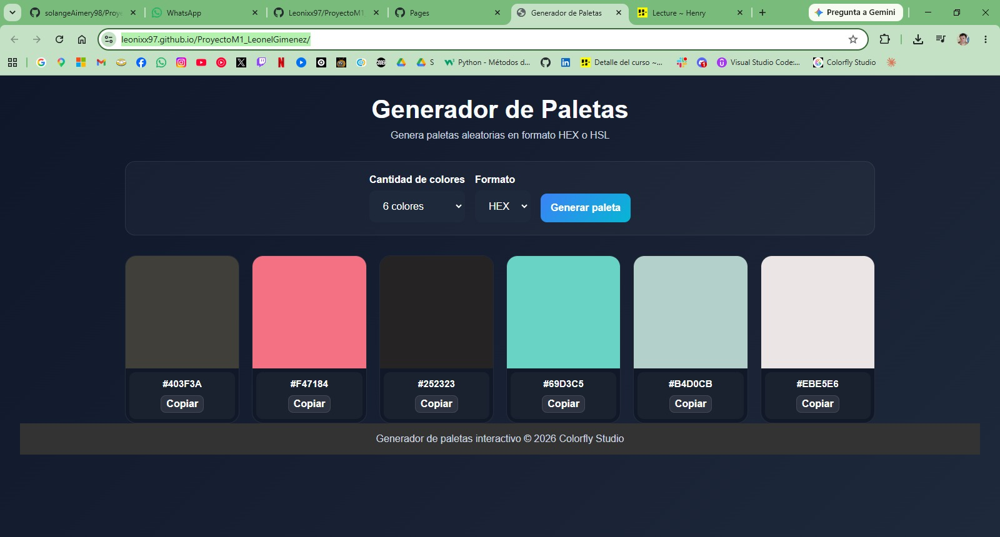
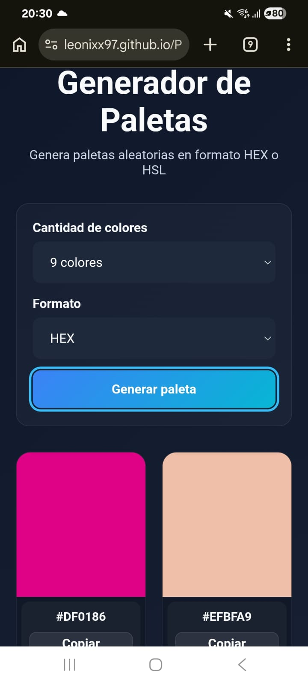
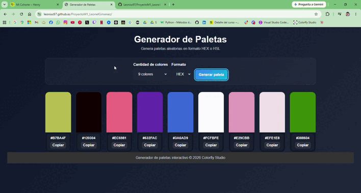

# 🎨 Generador de Paletas de Colores

Aplicación web estática e interactiva para generar paletas de colores aleatorias en formatos **HEX** y **HSL**.

---
🚀 Demostración en vivo

👉 https://leonixx97.github.io/ProyectoM1_LeonelGimenez/

# 🚀 Características

- Generación aleatoria de colores.
- Selección de tamaño de paleta:
  - 6 colores
  - 8 colores
  - 9 colores
- Selección de formato:
  - HEX
  - HSL
- Copiar códigos de color al portapapeles.
- Interfaz responsive.
- Microfeedback mediante toast notifications.
- HTML semántico.
- Accesibilidad básica implementada.

---

Vista previa

<p align="center">

### Version de escritorio: 



</p>

<p align="center">

### Version móvil:



</p>

<p align="center">

### Demo 



</p>

---

# 🛠️ Tecnologías utilizadas

- HTML5
- CSS3
- JavaScript Vanilla

---

# 📂 Estructura del proyecto

```bash
/
│── index.html
│── Styles.css
│── README.md
```

---

# ▶️ Cómo ejecutar el proyecto

1. Descargar o clonar el repositorio.

```bash
git clone https://github.com/tuusuario/generador-paletas.git
```

2. Abrir el archivo `index.html` en el navegador.

No requiere instalación de dependencias ni servidor.

---

🤖 Documentación de IA

La inteligencia artificial se utilizó como herramienta de aprendizaje y productividad durante el desarrollo de este proyecto.

Su propósito era ayudarme a comprender mejor los conceptos de JavaScript, explorar diferentes enfoques de implementación y mejorar la calidad del código, al tiempo que se garantizaba que cada característica fuera revisada, comprendida y adaptada antes de ser incorporada a la aplicación.

- **[Uso de IA](/activos/)**

---

# 🎯 Funcionalidades principales

## Generar paleta

La aplicación permite generar una nueva paleta mediante el botón:

```text
Generar paleta
```

Cada generación crea colores aleatorios según:

- Tamaño seleccionado
- Formato seleccionado

---

## Seleccionar formato

El usuario puede elegir entre:

### HEX

Ejemplo:

```text
#3B82F6
```

### HSL

Ejemplo:

```text
hsl(210, 91%, 60%)
```

---

## Copiar color

Cada tarjeta incluye un botón para copiar automáticamente el código del color al portapapeles.

---

# ♿ Accesibilidad

La aplicación incluye:

- Labels asociados correctamente.
- Focus visible en botones y selects.
- Uso de `aria-label`.
- Uso de `aria-live` para feedback dinámico.
- Contraste adecuado.

---

# 📱 Responsive Design

La interfaz se adapta correctamente a:

- Desktop
- Tablets
- Mobile

---

# 📸 Vista previa

## Desktop

- Grid responsive
- Tarjetas de colores
- Controles superiores

## Mobile

- Layout vertical adaptado
- Botones full width

---

# 📌 Alcance funcional cumplido

✔ Botón “Generar paleta” operativo  
✔ Generación correcta de colores aleatorios  
✔ Render dinámico según tamaño  
✔ Selección entre formatos HEX y HSL  
✔ Microfeedback visible  
✔ HTML semántico  
✔ Accesibilidad básica  
✔ Responsive  

---

# 👨‍💻 Autor

Desarrollado por Leonel Gimenez.